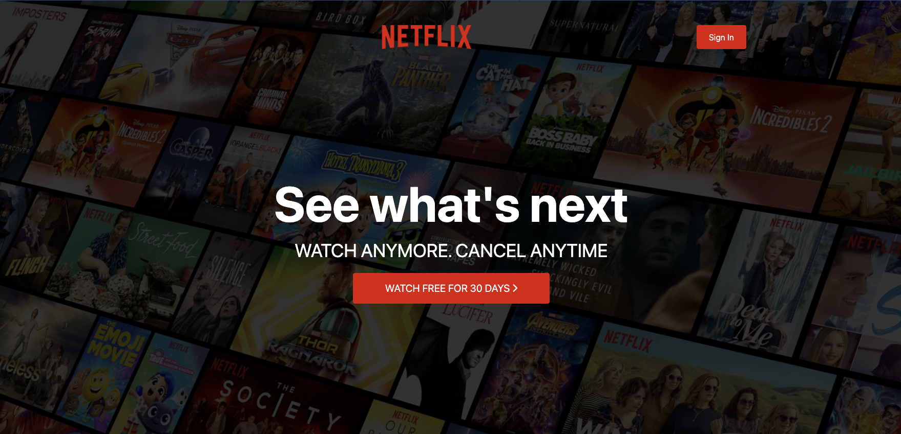
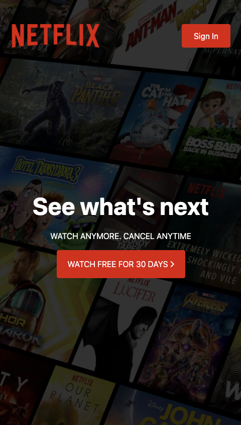

# Netflix - Clone

This project was inspired by [Brad Traversy Youtube Video](https://www.youtube.com/watch?v=P7t13SGytRk). I used his video as a guide for the overall design and to acquire the images / assets.

## Overview

Create a clone of the Netflix landing page:

- View the optimal layout depending on their device's screen size

### Screenshot

### Links

- Solution URL: [View Github Code](https://github.com/jchapar/netflix_clone)
- Live Site URL: [Visit Site](https://zingy-kheer-4f47c5.netlify.app/)

### Built with

- Semantic HTML5 markup
- TailwindCSS
- Flexbox
- CSS Grid
- Mobile-first workflow
